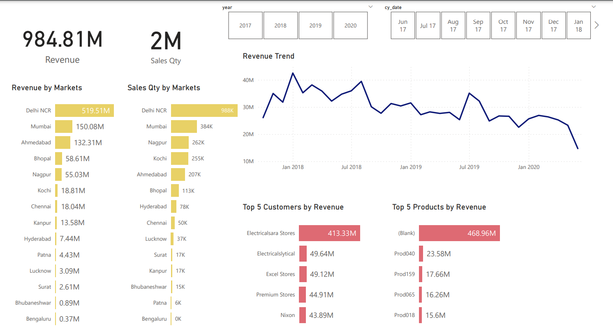

# Sales Insights Data Analysis Project

## Overview
This repository contains the code and documentation for a data analysis project focused on sales insights. The project utilizes MySQL for data cleaning and transformation and Power BI for data visualization and analysis.

## Project Structure
- __MySQL Scripts__: Contains scripts used for data cleaning and transformation in MySQL.
- __Power BI Files__: Includes Power BI report files used for data visualization and analysis.
- __Documentation__: Contains additional documentation related to the project.

## Getting Started
To replicate the analysis performed in this project, follow these steps:

1. Clone the Repository:
```
git clone https://github.com/Krishnann-s/DataAnalysisProject.git
```

2. Data Preparation and Data Understanding:
Instructions to setup mysql on your local computer

1. Follow step in this video to install mysql on your local computer
https://www.youtube.com/watch?v=uj4OYk5nKCg

1. SQL database dump is in MySQL_dump.sql file above. Download `MySQL_dump.sql` file to your local computer.
2. Create a new schema and Under __Server__ tab and select __Data Import__
3. In __Data Import__ select __Import from Self-Contanied File__ and navigate to the `MySQL_dump.sql` Path and Select __Start Import__
4. To see the imported database click on refresh.


__These are some set of Queries used to understand the data.__

- Show all customer records

    ```
    SELECT * FROM customers;
    ```

- Show total number of customers

    ```
    SELECT count(*) FROM customers;
    ```

- Show transactions for Chennai market (market code for chennai is Mark001)

    ```
    SELECT * FROM transactions where market_code='Mark001';
    ```

- Show distrinct product codes that were sold in chennai

    ```
    SELECT distinct product_code FROM transactions where market_code='Mark001';
    ```

- Show transactions where currency is US dollars

    ```
    SELECT * from transactions where currency="USD"
    ```

- Show transactions in 2020 join by date table

    ```
    SELECT transactions.*, date.* FROM transactions INNER JOIN date ON transactions.order_date=date.date where date.year=2020
    ```

- Show total revenue in year 2020,

    ```
    SELECT SUM(transactions.sales_amount) FROM transactions INNER JOIN date ON transactions.order_date=date.date where date.year=2020 and transactions.currency="INR\r" or transactions.currency="USD\r";
    ```
	
- Show total revenue in year 2020, January Month,

    ```
    SELECT SUM(transactions.sales_amount) FROM transactions INNER JOIN date ON transactions.order_date=date.date where date.year=2020 and and date.month_name="January" and (transactions.currency="INR\r" or transactions.currency="USD\r");
    ```

- Show total revenue in year 2020 in Chennai

    ```
    SELECT SUM(transactions.sales_amount) FROM transactions INNER JOIN date ON transactions.order_date=date.date where date.year=2020 and transactions.market_code="Mark001";
    ```


#### Data Analysis Using Power BI

__Formula to create norm_amount column__
```
= Table.AddColumn(#"Filtered Rows", "norm_amount", each if [currency] = "USD" or [currency] ="USD#(cr)" then [sales_amount]*75 else [sales_amount], type any)
```
2. Above code created 2 USD and 2 INR values, one with USD\r, which can be filtered.
3. After Filtering Select __Close&Apply__ from __Home__ tab



## Contributors
[Krishnan](https://github.com/Krishnann-s)


